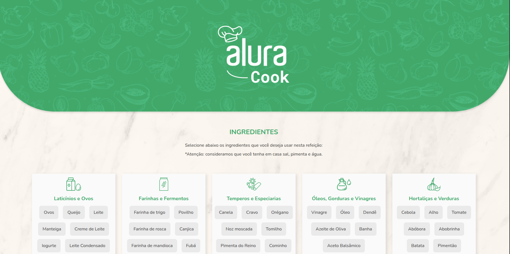

# Svelte Alura Cook

[](https://svelte-alura-cook.vercel.app)


Aplicação web desenvolvida com **Svelte / SvelteKit** baseada no projeto **Alura Cook**.

O sistema permite selecionar ingredientes e descobrir quais receitas podem ser preparadas com eles.

Este projeto foi desenvolvido como prática de **componentização, gerenciamento de estado com stores e navegação entre páginas**.


🚀 **Live Demo**  

https://svelte-alura-cook.vercel.app  


---

# Preview



---

# Tecnologias utilizadas

* Svelte
* SvelteKit
* JavaScript
* HTML
* CSS
* Node.js

---

# Funcionalidades

* Seleção de ingredientes
* Remoção de ingredientes da lista
* Busca de receitas com base nos ingredientes escolhidos
* Navegação entre páginas
* Gerenciamento de estado com **Svelte store**

---

# Arquitetura da aplicação

```
Browser
   |
   v
Svelte Components
   |
   v
Store (State Management)
   |
   v
Recipe Logic
```

A aplicação utiliza **stores do Svelte** para compartilhar estado entre múltiplos componentes da interface.

---

# Como executar o projeto

## 1 - Clonar o repositório

```bash
git clone https://github.com/Lubrum/svelte-alura-cook.git
cd svelte-alura-cook
```

---

## 2 - Instalar dependências

```bash
npm install
```

ou

```bash
yarn install
```

---

## 3 - Executar o projeto

```bash
npm run dev
```

ou

```bash
yarn dev
```

A aplicação ficará disponível em:

```
http://localhost:5173
```

---

# Build para produção

```bash
npm run build
```

---

# Estrutura do projeto

```
src
 ├── components
 ├── routes
 ├── stores
 ├── styles
 └── main.js
```

---

# Conceitos demonstrados

Este projeto demonstra conceitos importantes do ecossistema Svelte:

* componentização
* estado global com **store**
* comunicação entre componentes
* navegação entre páginas
* organização de projetos frontend

---

# Autor

Luciano Brum

GitHub
https://github.com/Lubrum

Website
https://lubrum.github.io

---

# Licença

Este projeto está licenciado sob a **MIT License**.
