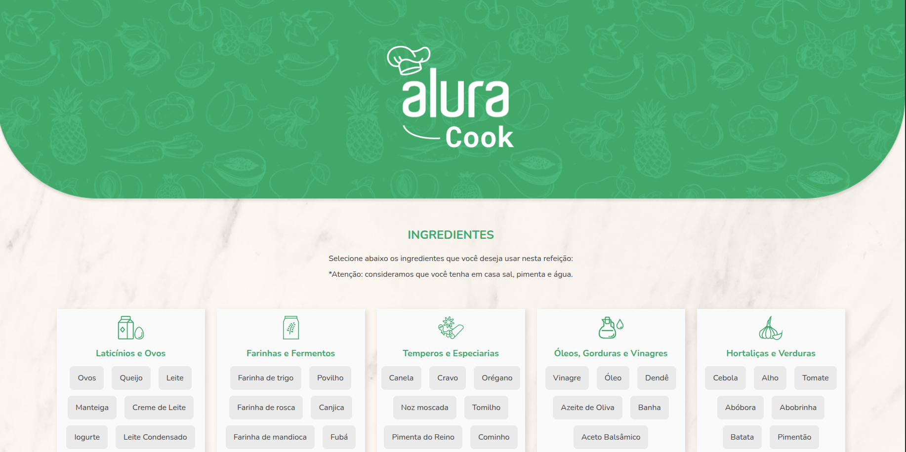

# Svelte Alura Cook

[](https://svelte-alura-cook.vercel.app)


Aplicação web desenvolvida com **SvelteKit** baseada no projeto **Alura Cook**.
O app permite selecionar ingredientes disponíveis e encontrar receitas que podem ser preparadas com eles.

## Preview



## Funcionalidades

- Seleção e remoção de ingredientes
- Lista compartilhada entre páginas com Svelte store
- Busca de receitas compatíveis com todos os ingredientes escolhidos
- Bloqueio da busca quando a lista está vazia
- Interface responsiva construída com componentes Svelte

## Tecnologias

- Svelte 5
- SvelteKit 2
- Vite 8
- TypeScript
- CSS
- Node.js LTS

## Como executar

Instale as dependências:

```bash
npm install
```

Inicie o servidor de desenvolvimento:

```bash
npm run dev
```

A aplicação ficará disponível em `http://localhost:5173`.

## Scripts

```bash
npm run check
npm run build
npm run preview
```

## Estrutura

```text
src
├── lib
│   ├── components
│   ├── interfaces
│   ├── json
│   └── stores
└── routes
```

## Autor

Luciano Brum

- GitHub: https://github.com/Lubrum
- Website: https://lubrum.github.io

## Licença

Este projeto está licenciado sob a MIT License.
